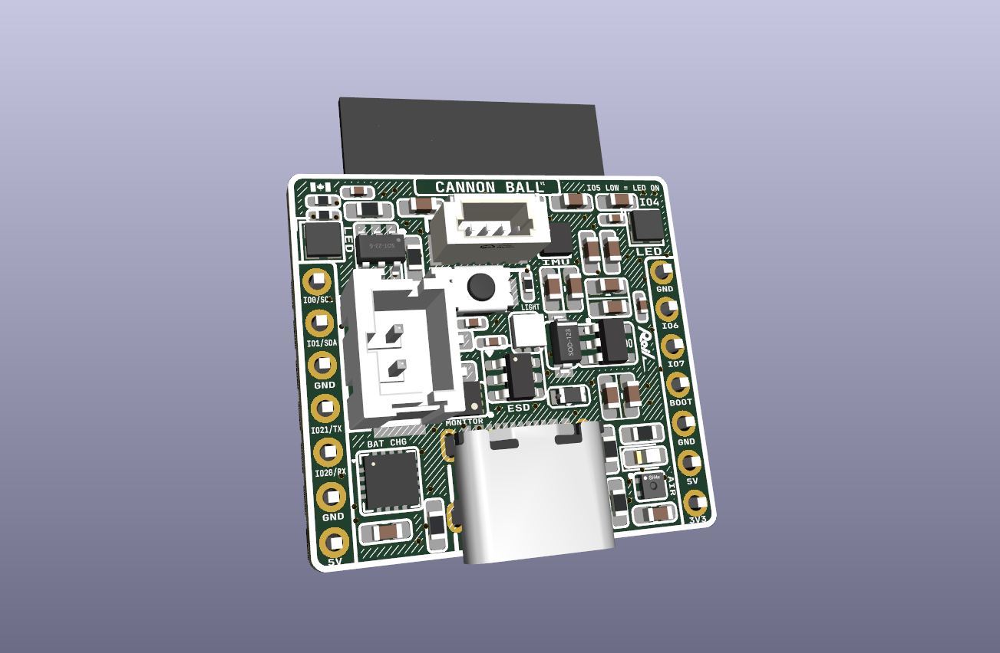

# REIL INDUSTRIAL - CANNONBALL

A feature-packed ESP32-C3 development board built around the **ESP32-C3-WROOM-02-N4**, designed to be the last board you need for any project — smart home device, RC car, wearable, or anything else you can dream up.

The big pitch: pull a single-cell LiPo or Li-ion from an old vape, plug it into the JST PH connector, and go. The board handles charging, protection, and fuel gauging — no external circuitry needed.

---

## Features

- **MCU** — ESP32-C3-WROOM-02-N4 (RISC-V, 2.4 GHz Wi-Fi + BLE, 4 MB flash)
- **USB protection** — USBLC6-4SC6 TVS diode array on the USB lines
- **Battery charging** — BQ24075RGT linear charger (100 mA default, 500 mA selectable via GPIO)
- **Battery protection** — DW01A + FS8205A dual MOSFET pack (over-charge, over-discharge, short circuit)
- **Battery monitoring** — MAX17048 fuel gauge over I2C with low-battery alert
- **3.3 V regulation** — AP2112K-3.3 LDO
- **Addressable LEDs** — SK6812-EC20 RGB LEDs switched via DMG2301L MOSFET
- **IMU** — LSM6DS3 (6-axis accelerometer + gyroscope, I2C)
- **Temp & humidity** — SHT40 (I2C)
- **Light sensor** — VEML6030 ambient light sensor (I2C)
- **I2C expansion** — JST SH 1.0 mm 4-pin connector (3.3 V, GND, SDA, SCL)
- **Battery connector** — JST PH 2.0 mm 2-pin

---

## Power

| Rail | Source | Voltage | Notes |
|------|--------|---------|-------|
| USB-C | External | 5 V nominal, **6 V max** | Limited by AP2112K-3.3 LDO max input. Do not exceed 6 V on the 5 V pins or USB input. |
| 5V pin (J5/J6) | External or VBUS | 5 V nominal, **6 V max** | Same rail as USB VBUS — feeds the LDO and charger directly. |
| 3V3 pin (J4/J6) | AP2112K-3.3 LDO | **3.3 V exactly** | If powering the board externally via the 3V3 pin (bypassing the LDO), supply a regulated 3.3 V. The ESP32 and all peripherals run at 3.3 V with a ±0.3 V tolerance — do not exceed 3.6 V or drop below 3.0 V. |

---

## Pin Reference

| GPIO | Function | Notes |
|------|----------|-------|
| 3 | MAX17048 alert | Active-low interrupt when battery is low |
| 4 | SK6812 data | Addressable LED data line |
| 5 | LED enable (MOSFET) | Pull **high** to enable LEDs, low to disable |
| 10 | BQ24075 EN1 (charge rate) | Pull **high** to increase charge current from 100 mA to 500 mA |

---

## Bill of Materials

| Reference | Part | Function |
|-----------|------|----------|
| U1 | ESP32-C3-WROOM-02-N4 | Main MCU |
| U2 | BQ24075RGT | Li-ion/LiPo battery charger |
| U3 | MAX17048 | Battery fuel gauge (I2C) |
| U4 | DW01A | Battery protection IC |
| U5 | FS8205A | Dual MOSFET for battery protection |
| U6 | AP2112K-3.3 | 3.3 V LDO regulator |
| U7 | USBLC6-4SC6 | USB ESD/TVS protection |
| U8 | LSM6DS3 | 6-axis IMU (I2C) |
| U9 | SHT40 | Temperature & humidity sensor (I2C) |
| U10 | VEML6030 | Ambient light sensor (I2C) |
| Q3 | 2N7002K | N-channel MOSFET (LED power switch) |
| LED1+ | SK6812-EC20 | Addressable RGB LEDs |

---

## Opening in KiCad

1. Clone or download this repo
2. Open KiCad and select **File → Open Project**
3. Navigate to the repo folder and open `CANNONBALL.kicad_pro`

All schematic symbols and footprints are either embedded in the project files or included in the `jlcpcb.pretty/` and `jlcpcb.kicad_sym` local libraries — no additional library setup required.

---

## Battery Compatibility

Any single-cell LiPo or Li-ion (3.6–4.2 V nominal) will work. The onboard protection circuit guards against:
- Over-charge (> 4.2 V)
- Over-discharge (< 2.5 V)
- Short circuit / over-current

Cells salvaged from vapes, old phones, or RC packs all work fine. Use the JST PH 2.0 mm 2-pin connector (positive on pin 1).
